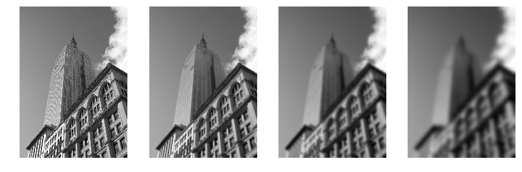

基本的图像操作和处理
<!-- more -->

# 1.1 PIL

## 库的导入以及图像的显示方法


```python
from PIL import Image
```


```python
pil_im = Image.open('empire.jpg')
pil_im.show()
```

## 1.1.1 转换图像格式

使用`save()`方法保存，根据文件扩展名判断图像的格式

## 1.1.2 创建缩略图

使用`thumbnail`方法创建缩略图，例如


```python
pil_im.thumbnail((128, 128))
pil_im.show()
```

## 1.1.3 复制和粘贴图像区域


```python
pil_im = Image.open('empire.jpg')

box = (100, 100, 400, 400)
region = pil_im.crop(box)

region = region.transpose(Image.ROTATE_180)
pil_im.paste(region, box)

pil_im.show()
```

## 调整尺寸和旋转


```python
out = pil_im.resize((128, 128))
out.show()

out = pil_im.rotate(45)
out.show()
```

# 1.2 Matplotlib

## 1.2.1 绘制图像、点和线


```python
from PIL import Image
from pylab import *

# 读取图像到数组中
im = array(Image.open('empire.jpg'))

figure(figsize = (20, 10))
# 绘制图像
imshow(im)

# 点
x = [100, 100, 400, 400]
y = [200, 500, 200, 500]

# 使用红色星状标记绘制点
plot(x, y, 'r*')

# 绘制连接线
plot(x[:2], y[:2])

# 添加标题，显示绘制的图像
title('Plotting: "empire.jpg"')
show()
```


## 1.2.2 图像轮廓和直方图


```python
from PIL import Image
from pylab import *

# 读取图像到数组中
im = array(Image.open('empire.jpg').convert('L'))

# 新建图像
figure(figsize = (15,5))
gray()

# 在原点的左上角显示轮廓图像
subplot(1,2,1)
contour(im, origin = 'image')

axis('equal')
axis('off')

# 直方图
subplot(1,2,2)
hist(im.flatten(), 128)

# 显示图像
show()
```


## 1.2.3 交互式标注

代码如下所示：
```python
from PIL import Image
from pylab import *

im = array(Image.open('empire.jpg'))
imshow(im)

print 'Please click 3 points'

x = ginput(3)

print 'you clicked :', x

show()
```
示例参见1_2_3.py

# 1.3 NumPy

Python科学计算工具包

## 1.3.1 图像数组表示


```python
from PIL import Image
from numpy import *

im = array(Image.open('empire.jpg'))
print im.shape, im.dtype

im = array(Image.open('empire.jpg').convert('L'), 'f')
print im.shape, im.dtype
```

    (1024, 707, 3) uint8
    (1024, 707) float32


NumPy数组访问方式与Python类似

## 1.3.2 灰度变换


```python
from PIL import Image
from numpy import *

figure(figsize = (30, 10))
gray()

im = array(Image.open('empire.jpg').convert('L'))
subplot(2,4,1)
imshow(im)
subplot(2,4,5)
hist(im.flatten(), 128)

# 反相操作
im2 = 255 - im
subplot(2,4,2)
imshow(im2)
subplot(2,4,6)
hist(im2.flatten(), 128)

# 将图像像素值变换到100-200区间
im3 = (100.0/255) * im + 100
subplot(2,4,3)
imshow(im3)
subplot(2,4,7)
hist(im3.flatten(), 128)

# 对图像像素值求平方后得到的图像
im4 = 255.0 * (im/255.0)**2
subplot(2,4,4)
imshow(im4)
subplot(2,4,8)
hist(im4.flatten(), 128)

show()
```


## 1.3.3 图像缩放


```python
""" 图像缩放 """
def imresize(im, sz):
	pil_im = Image.fromarray(uint8(im))

	return array(pil_im.resize(sz))
```

## 1.3.4 直方图均衡化


```python
import imtools
from PIL import Image
from numpy import *

im = array(Image.open('empire.jpg').convert('L'))
im2, cdf = imtools.histeq(im)

figure(figsize = (20, 10))
gray()

subplot(2,2,1)
imshow(im)
subplot(2,2,3)
hist(im.flatten(), 128)

subplot(2,2,2)
imshow(im2)
subplot(2,2,4)
hist(im2.flatten(), 128)

show()
```


## 1.3.5 图像平均


```python
""" 图像平均 """
def compute_average(imlist):

	# 打开第一幅图像，将其存储在浮点型数组中
	averageim = array(Image.open(imlist[0]), 'f')

	for imname in imlist[1:]:
		try:
			averageim += array(Image.open(imname))
		except:
			print imname + '...skipped'

	averageim /= len(imlist)

	# 返回uint8类型的平均图像
	return array(averageim, 'uint8')
```

## 1.3.6 图像的主成分分析（PCA）


```python
""" 主成分分析：
	输入：矩阵X，其中该矩阵中存储训练数据，每一行为一条训练数据
	返回：投影矩阵（按照维度的重要性排序）、方差和均值 """
def pca(X):
	# 获取维数
	num_data, dim = X.shape

	# 数据中心化
	mean_X = X.mean(axis = 0)
	X = X - mean_X

	if dim > num_data:
		# 使用紧致技巧

		# 协方差矩阵
		M = dot(X, X.T)
		# 特征值和特征向量
		e, EV = linalg.eigh(M)
		# 紧致技巧
		tmp = dot(X.T, EV).T

		# 由于最后的特征向量是我们所需要的，所以需要将其逆转
		V = tmp[::-1]
		# 由于特征值是按照递增顺序排列的，所以需要将其逆转
		S = sqrt(e)[::-1]

		for i in range(V.shape[1]):
			V[:, i] /= S
	else:
		# 使用SVD方法
		
		U, S, V = linalg.svd(X)
		# 仅仅返回前num_data维数据
		V = V[:num_data]

	# 返回投影矩阵、方差和均值
	return V, S, mean_X
```

## 1.3.7 保存数据

### 使用pickle模块
使用pickle可以封装几乎所有的python对象

*封装*
```python
with open('font_pca_modes.pkl', 'wb') as f:
    pickle.dump(immean, f)
    pickle.dump(V, f)
```
*拆封*
```python
with open('font_pca_modes.pkl', 'rb') as f:
    immean = pickle.load(f)
    V = pickle.load(f)
```

### 使用NumPy的读写函数
如果数据结构不复杂，可以直接将其存为文本文件

```python
savetxt('test.txt', x, '%i')
x = loadtxt('test.txt')
```

# 1.4 Scipy

## 1.4.1 图像模糊


```python
from PIL import Image
from pylab import *
from numpy import *
from scipy.ndimage import filters

figure(figsize = (15,10))
gray()

im = array(Image.open('empire.jpg').convert('L'))
sigma = [0, 2, 5, 10]

for i in range(4):
    subplot(1,4,i+1)
    imshow(filters.gaussian_filter(im, sigma[i]))
    axis('off')

show()
```


## 1.4.2 图像导数

描述图像强度变化的强弱


```python
from PIL import Image
from pylab import *
from numpy import *
from scipy.ndimage import filters

figure(figsize = (15,10))
gray()

im = array(Image.open('empire.jpg').convert('L'))
subplot(1,4,1)
imshow(im)
axis('off')

# Sobel导数滤波器
imx = zeros(im.shape)
filters.sobel(im, 1, imx)
subplot(1,4,2)
imshow(imx)
axis('off')

imy = zeros(im.shape)
filters.sobel(im, 0, imy)
subplot(1,4,3)
imshow(imy)
axis('off')

magnitude = sqrt(imx**2 + imy**2)
subplot(1,4,4)
imshow(magnitude)
axis('off')

show()
```





```python
from PIL import Image
from pylab import *
from numpy import *
from scipy.ndimage import filters

figure(figsize = (15,10))
gray()

im = array(Image.open('empire.jpg').convert('L'))
subplot(1,4,1)
imshow(im)
axis('off')

sigma = 10

# 高斯导数滤波器
imx = zeros(im.shape)
filters.gaussian_filter(im, (sigma, sigma), (0, 1), imx)
subplot(1,4,2)
imshow(imx)
axis('off')

imy = zeros(im.shape)
filters.gaussian_filter(im, (sigma, sigma), (1, 0), imy)
subplot(1,4,3)
imshow(imy)
axis('off')

magnitude = sqrt(imx**2 + imy**2)
subplot(1,4,4)
imshow(magnitude)
axis('off')

show()
```


## 1.4.3 形态学：对象计数

使用morphology和measurements模块，没有合适的图片，暂空

## 1.4.4 一些有用的SciPy模块

### io模块读写.mat文件

```python
data = scipy.io.loadmat('test.mat')

data = {}
data['x'] = x
scipy.io.savemat('test.mat', data)
```

### misc模块将数组对象保存为图像形式

```python
scipy.misc.imsave('test.jpg', im)
```

# 1.5 图像去噪

图像去噪是在去除图像噪声的同时，尽可能地保留图像细节和结构的处理技术。

这里使用ROF(Rudin-Osher-Fatemi)去噪模型


```python
from numpy import *
from numpy import random
from scipy.ndimage import filters
import rof

# 使用噪声创建合成图像
im = zeros((500, 500))
im[100:400, 100:400] = 128
im[200:300, 200:300] = 255
im_noise = im + 30*random.standard_normal((500, 500))

U, T = rof.denoise(im_noise, im_noise)

figure(figsize = (15, 10))
gray()

subplot(1,3,1)
imshow(im)
axis('off')

subplot(1,3,2)
imshow(im_noise)
axis('off')

subplot(1,3,3)
imshow(U)
axis('off')

show()
```


